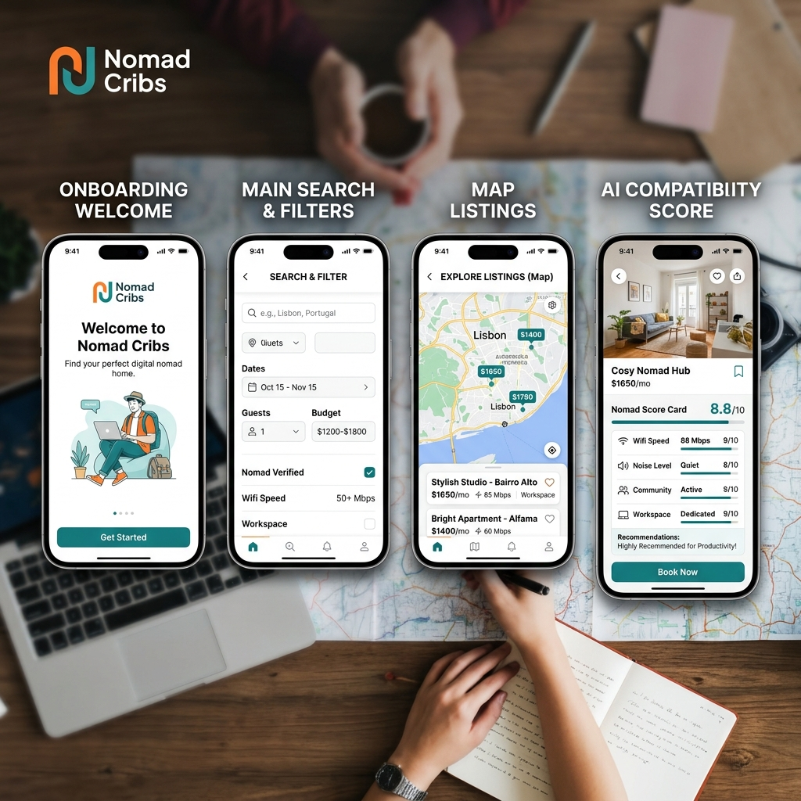
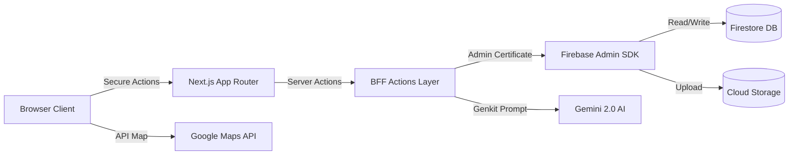
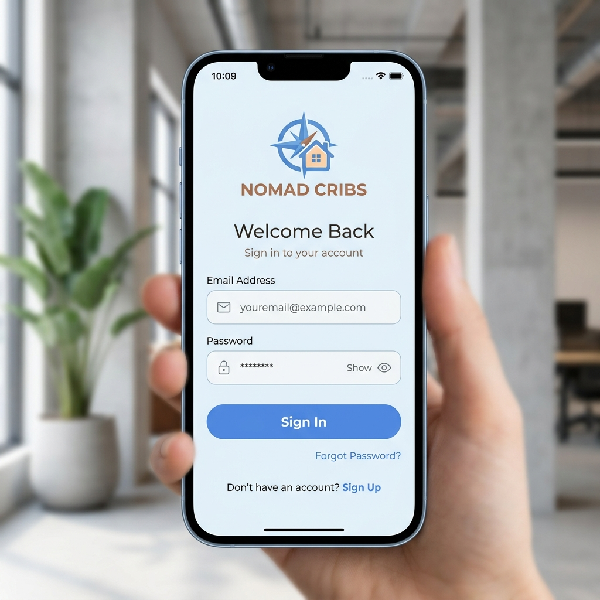
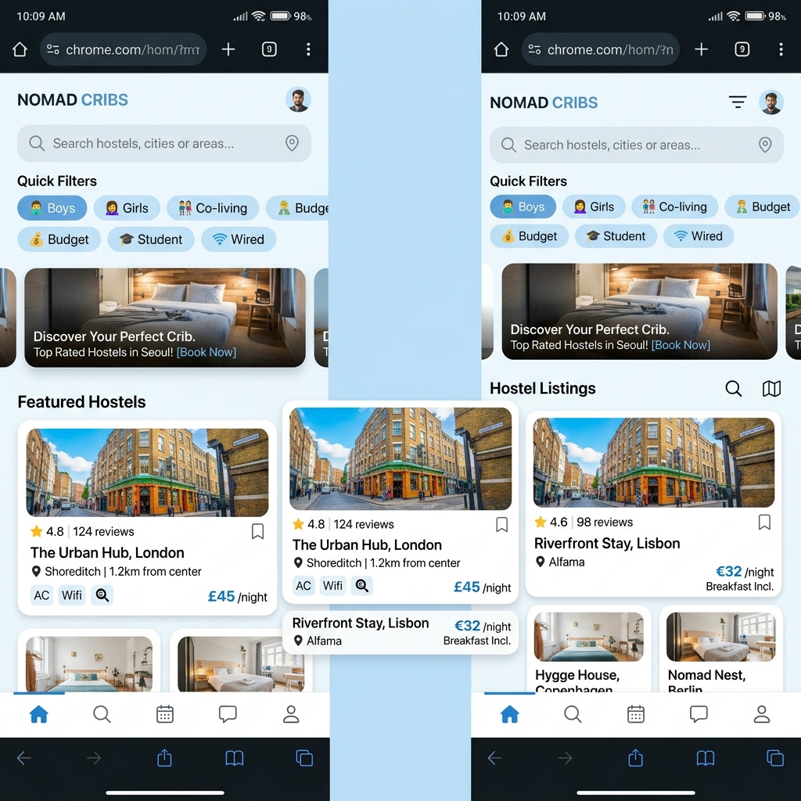
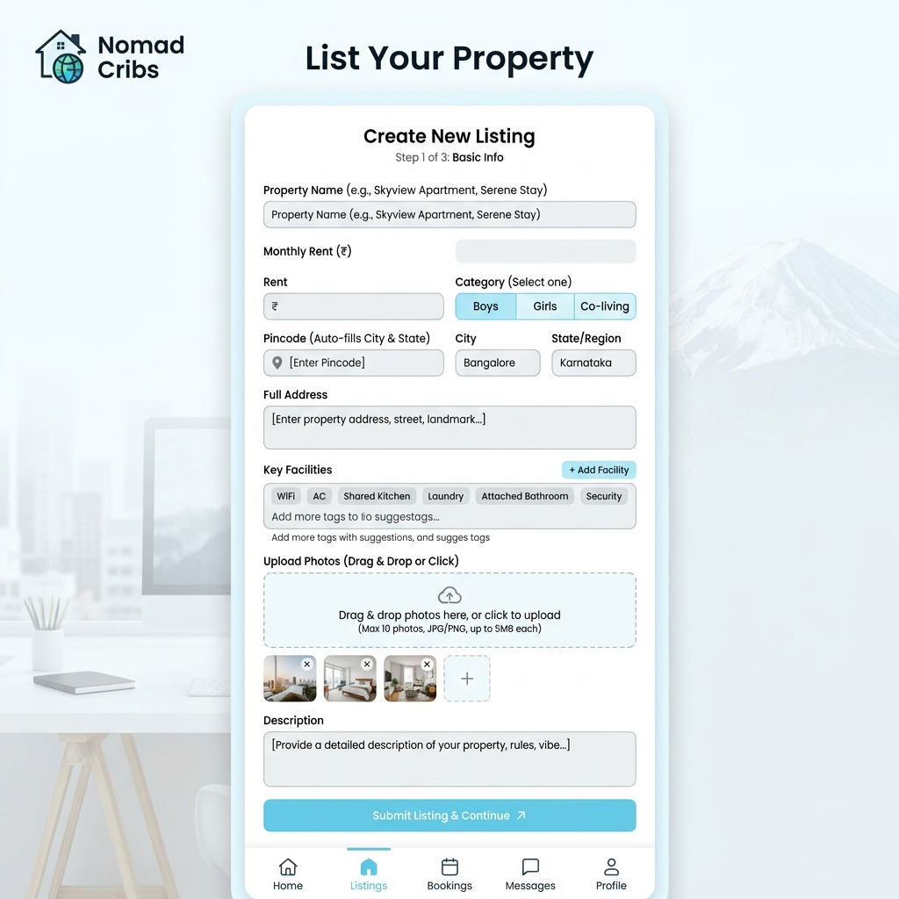
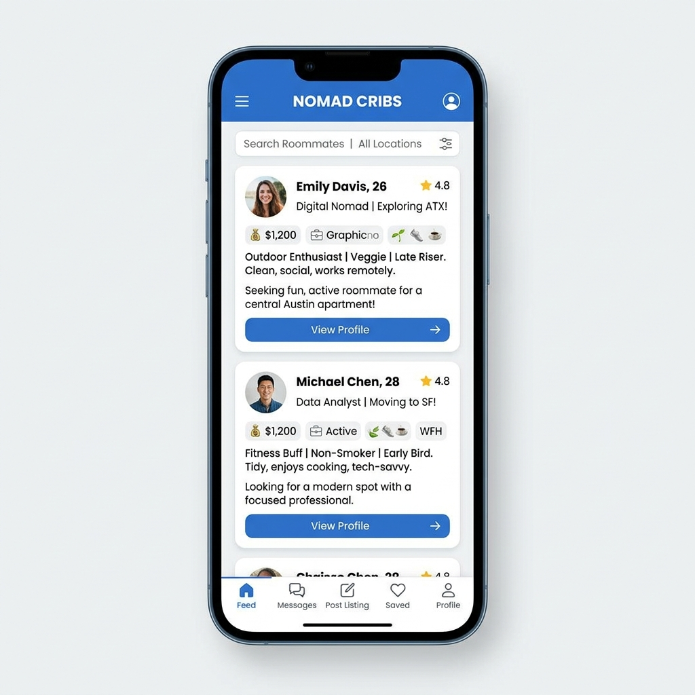
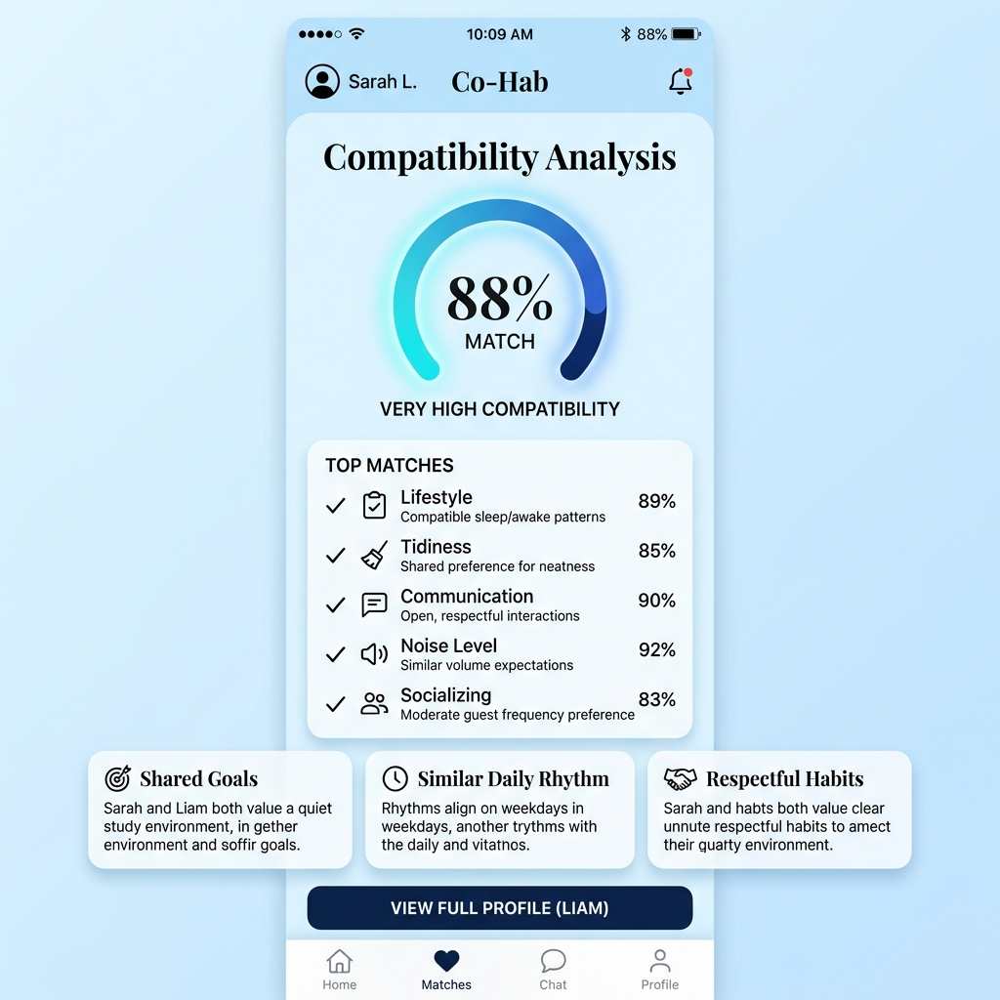
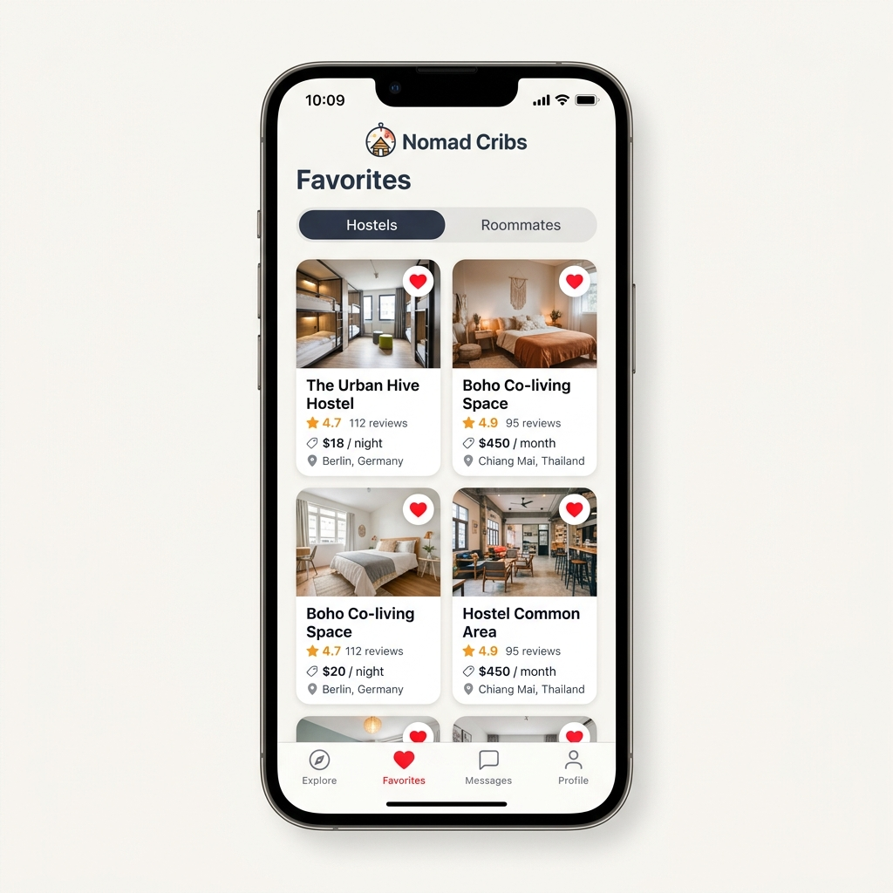

# 🏢 Hostel Finder (Nomad Cribs)

[](https://nextjs.org/)
[](https://firebase.google.com/)
[](https://firebase.google.com/docs/genkit)
[](https://www.typescriptlang.org/)
[](https://tailwindcss.com/)
[](LICENSE)
[](https://github.com/gadam/Hostel-Finder/commits/main)
[](https://github.com/gadam/Hostel-Finder)
[](https://github.com/gadam/Hostel-Finder/issues)

A next-generation, mobile-first web portal for finding ideal hostels and roommate matches. Powered by **Next.js**, **Firebase**, and **Google Genkit AI** with **Gemini 2.0 Flash**.



🚀 **[Live Project Demo Link](https://hostel-finder-master.web.app/)** | 📖 **Detailed Docs:** [Architecture](docs/ARCHITECTURE.md) • [Database Schema](docs/DATABASE.md) • [APIs](docs/API.md) • [Security & Validation](docs/SECURITY.md)

---

## 🚀 Key Features

* **🔐 Secure Authentication:** Robust email/password signup and session persistence using Firebase Auth.
* **🏠 Hostel & Roommate Listings:** Browse and search active listings with categorizations (boys, girls, co-living).
* **🤖 AI-Powered Roommate Matching:** Instantly evaluates compatibility criteria against listings via Gemini 2.0.
* **📍 Google Maps & Geolocation:** Dynamic map visualizers featuring coordinates geocoding.
* **⭐ Reviews & Ratings:** Add ratings and comment feedbacks with automated average score recalculation.
* **❤️ Favorites:** Tap a heart button to instantly bookmark accommodations.
* **📱 Fully Responsive Design:** Fluid Tailwind UI engineered for mobile, tablet, and desktop viewports.
* **☁️ Cloud Image Uploads:** Supports direct multiple image uploads stored inside Cloud Storage buckets.

### 📊 Project Metrics

* **Pages:** 15+ Route views
* **Components:** 40+ Reusable UI elements
* **Server Actions:** 10+ Isolated database operations
* **AI Pipelines:** 1 Google Genkit Flow
* **Third-Party APIs:** 3 (Google Maps, India Post, Gemini 2.0)
* **Status:** Ready for production deployment

---

## 💡 Problem & Solution

### ❌ The Problem
Finding affordable housing or suitable roommates in new cities is usually plagued by fake listings, mismatched roommates, manual address verification, and slow search tools.

### ✅ The Solution
**Nomad Cribs** provides a modern, fast platform featuring:
* **✔ Interactive Onboarding:** Guides new users via a modern splash wizard.
* **✔ Automated Address Verification:** Resolves city/state parameters instantly from 6-digit postal pincodes.
* **✔ Automated AI Matching:** Uses Gemini 2.0 to compare personal lifestyles against property lists.

---

## 📋 Feature Status & Delivery

| Feature | Status | Backend Service |
| :--- | :--- | :--- |
| **Authentication** | ✅ Production Ready | Firebase Client Auth |
| **Hostel & Room Search** | ✅ Production Ready | Firestore Queries |
| **AI Roommate Matching** | ✅ Production Ready | Google Genkit + Gemini 2.0 |
| **Google Maps Integration**| ✅ Production Ready | `@vis.gl/react-google-maps` |
| **Reviews & Ratings** | ✅ Production Ready | Server Actions Aggregate |
| **Bookmarks / Favorites** | ✅ Production Ready | Firestore Favorites Collection |
| **Image Uploads** | ✅ Production Ready | Cloud Storage Buckets |
| **Mobile-First Responsive**| ✅ Production Ready | Tailwind Media Rules |

---

## 🏗️ System Architecture & Design

### Technical Stack Data Flow


### 📂 System Design Flows

1. **Authentication Flow:** User credentials are input on the client $\rightarrow$ Firebase Client Auth verifies tokens $\rightarrow$ Session details route to next-auth/cookies $\rightarrow$ Secure routes block unauthenticated traffic.
2. **Data & AI Flow:** User submits criteria text $\rightarrow$ Next.js Server Action captures criteria $\rightarrow$ Genkit structures a prompt template $\rightarrow$ Gemini evaluates compatibility and returns structured JSON $\rightarrow$ Client displays matching metrics progress bar.
3. **Deployment Flow:** Local repository build $\rightarrow$ Firebase CLI triggers $\rightarrow$ Runs optimization builds defined in `apphosting.yaml` $\rightarrow$ Deploys client server via Firebase App Hosting.

---

## 🖼️ Application Screenshots

| Login View | Signup View |
| :---: | :---: |
|  |  |

| Dashboard View | Listings Details |
| :---: | :---: |
|  |  |

| Post Listing Form | Roommate Directory |
| :---: | :---: |
|  |  |

| AI Compatibility Match | Saved Favorites |
| :---: | :---: |
|  |  |

---

## 🧠 Core Engineering Challenges

### 1. Authentication & Security Architecture
* **Challenge:** Preventing client keys leaks while locking Firestore write access.
* **Solution:** Configured Firebase Client Auth solely for login verification. Privileged writes (such as listings creation or reviews updates) are funneled through Next.js Server Actions using the Firebase Admin SDK certificate keys securely stored inside server envs.

### 2. Scale-Resilient Firestore Aggregator
* **Challenge:** Live queries averaging rating scores across hundreds of documents created substantial latency.
* **Solution:** Created an event-driven review system. The Server Action writes review documents and simultaneously triggers an atomic batch recalculating and saving average scores on the parent hostel record, reducing detail page queries to $O(1)$.

### 3. Prompt Injection Defense in Genkit
* **Challenge:** Malicious roommate input attempting to override baseline matching prompts.
* **Solution:** Configured strict schemas using `zod` inside the Genkit flow definition. Inputs are sanitized as variable objects before binding templates, blocking text injection overrides.

---

## ⚡ Performance Optimizations

* **Server-Side Rendering (SSR):** Details and listing indexes use SSR for SEO optimization and first-contentful-paint speeds.
* **Dynamic Code Splitting:** Heavy UI components (e.g. Google Maps components) are lazily loaded using dynamic imports to minimize first-load bundles size.
* **Optimized Image Validation:** Enforces a `<5MB` image upload constraint on the server side to regulate memory usage and expedite image loading times.
* **Persistent Cache:** Onboarding wizard status cached in `localStorage` to save startup loads.

---

## 🚀 Installation & Command Reference

### 1. Clone & Set Envs (`.env.local`)
```bash
git clone https://github.com/yourusername/Hostel-Finder.git
cd Hostel-Finder
npm install
```
Add public client configurations (`NEXT_PUBLIC_FIREBASE_*`), private credentials (`FIREBASE_PRIVATE_KEY`), Google Maps key (`NEXT_PUBLIC_GOOGLE_MAPS_API_KEY`), and `GEMINI_API_KEY` to the `.env.local` file.

### 2. Development Commands
* Run local development server: `npm run dev`
* Run Genkit Developer Console: `npm run genkit:dev`
* Compile production bundle: `npm run build`
* Verify syntax styling: `npm run lint`
* Verify TypeScript compiler: `npm run typecheck`

---

## 📅 Roadmap & Future Enhancements

- [x] Firebase Client & Admin SDK decoupling
- [x] AI Compatibility matching using Gemini 2.0
- [x] Geocoding & interactive maps display
- [ ] Real-time websocket messaging with landlords (Redis backend)
- [ ] Push Notifications using Cloud Messaging
- [ ] Map boundaries radius search optimization
- [ ] Multi-tenant Admin Dashboard & Analytics tracking
- [ ] CI/CD pipeline automation with Docker containerization

---

## 📄 License
Distributed under the MIT License. See `LICENSE` for details.
