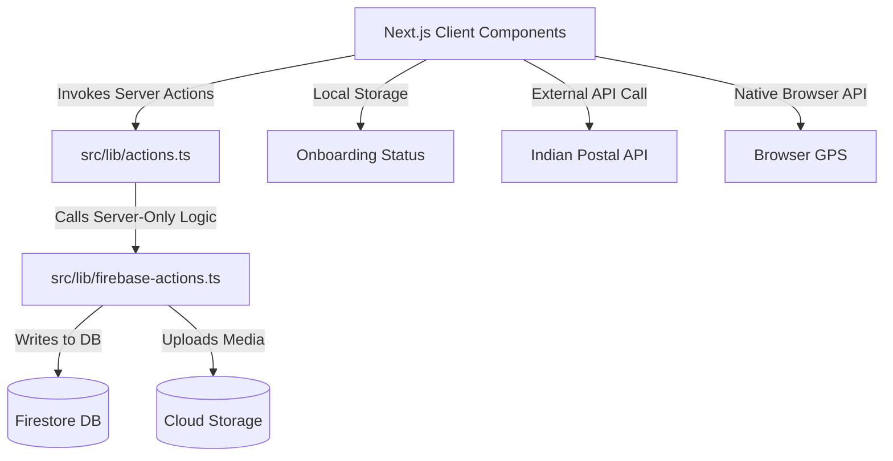
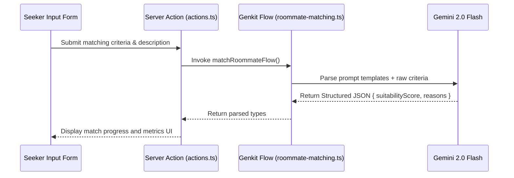

# 🏗️ Architecture & System Design Document

This document outlines the detailed system design, client-server relationships, caching logic, and framework design of the **Hostel Finder (Nomad Cribs)** project.

---

## 🛠️ Design Patterns & Data Flow

### 1. Hybrid Server-Client Architecture
* **Client-Side rendering:** The frontend uses React client hooks (`useAuth`, `useToast`, `useMobile`) to control views, animations (using `@dotlottie/player-component`), and interactive forms (`react-hook-form`).
* **Next.js Server Actions:** Acts as the Backend-for-Frontend (BFF) layer. Operations that alter database states (writes, deletes, updates) are strictly run as server actions to isolate credentials.
* **Firebase SDK Splitting:** 
  * `firebase.ts` (Client SDK): Only initialized for Authentication state management and listener-based reads to keep bundles light.
  * `firebase-admin.ts` (Admin SDK): Only initialized on the server via `firebase-admin` package. It uses a private credential certificate (`FIREBASE_PRIVATE_KEY` and `FIREBASE_CLIENT_EMAIL`) to manage Firestore writes and Storage uploads.

---

## 🚀 Data Verification & External Services

### 🗺️ Geocoding & Address Mapping
1. **Postal Pincode Resolution:** Upon typing a 6-digit PIN code on listing posts, the client makes a REST request to `https://api.postalpincode.in/pincode/${code}` to auto-populate the District, State, and City fields.
2. **Reverse Geocoding:** When clicking **"Detect Location"**, the browser geolocation API collects latitude/longitude. Next.js triggers a geocoding request to Google Maps Reverse Geocoding API, pre-filling specific landmark routes.
3. **Firestore Serialization:** Server actions map listings with latitude (`lat`) and longitude (`lng`) fields, allowing the `@vis.gl/react-google-maps` component to plot location pins.

---

## 🤖 Google Genkit Integration

### Flow Execution Details
1. **Flow Definition:** Defined inside `src/ai/flows/roommate-matching.ts` using Google Genkit's `ai.defineFlow` and `ai.definePrompt`.
2. **Model Plugin:** Uses `@genkit-ai/googleai` with model `googleai/gemini-2.0-flash`.
3. **Structured Outputs:** Enforces schemas with `zod` to return a score (`suitabilityScore`) and detailed analyses (`reasons`) dynamically.
