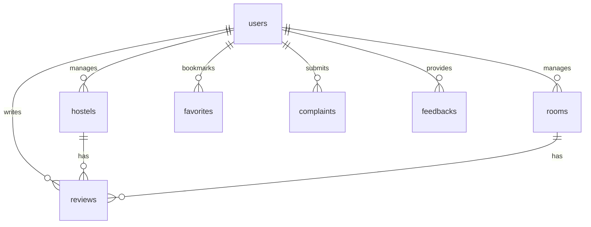

# 🗄️ Database Schema & Collections Design

This document details the schema definitions and collection layouts for **Hostel Finder (Nomad Cribs)**, implemented in Google Cloud Firestore.

---

## 🗺️ Entity Relationship Layout

---

## 📁 Firestore Collections

### 1. `users`
Represents the user account profile.

| Field | Type | Description |
| :--- | :--- | :--- |
| `id` (Doc ID) | String | Firebase Authentication UID. |
| `name` | String | User's full name. |
| `email` | String | Email address (unique). |
| `phone` | String | Contact telephone number (optional). |
| `avatar` | String | Storage public URL for user profile picture. |
| `createdAt` | Timestamp | Account creation timestamp. |

---

### 2. `hostels`
Stores hostel listings posted by users.

| Field | Type | Description |
| :--- | :--- | :--- |
| `id` (Doc ID) | String | Autogenerated document ID. |
| `name` | String | Name of the hostel. |
| `location` | String | Full resolved location address. |
| `city` | String | City name. |
| `areaLandmark` | String | Local area or street landmark. |
| `price` | String | Monthly rent in INR. |
| `owner` | Map | `{ name: String, avatar: String }` metadata. |
| `description` | String | Comprehensive description. |
| `type` | String | Targets (e.g., `boys`, `girls`, `coliving`). |
| `image` | String | Main thumbnail image URL. |
| `images` | Array[String] | Gallery image URLs (max 4). |
| `facilities` | Array[String] | Selected amenities. |
| `sharingType` | Array[String] | Options for sharing (e.g., 2-sharing). |
| `roomType` | Array[String] | AC / Non-AC types. |
| `userId` | String | Reference ID to the listing owner (`users.id`). |
| `contact` | String | 10-digit contact telephone number. |
| `rating` | Number | Dynamic average user rating (0.0 - 5.0). |
| `lat` | Number | Geocoded Latitude coordinate (optional). |
| `lng` | Number | Geocoded Longitude coordinate (optional). |
| `createdAt` | Timestamp | Server-generated timestamp. |

---

### 3. `rooms`
Represents listings seeking roommates.

| Field | Type | Description |
| :--- | :--- | :--- |
| `id` (Doc ID) | String | Autogenerated document ID. |
| `name` | String | Posted roommate/contact name. |
| `age` | Number | Age of the seeker. |
| `occupation` | String | Professional designation or "Student". |
| `rent` | String | Expected rent range. |
| `location` | String | Full resolved location address. |
| `about` | String | Lifestyle bio description. |
| `type` | String | Filter category target. |
| `image` | String | Main thumbnail image URL. |
| `images` | Array[String] | Gallery image URLs. |
| `postedBy` | Map | `{ name: String, avatar: String }` metadata. |
| `userId` | String | Creator ID (`users.id`). |
| `contact` | String | Contact phone number. |
| `preferences` | Array[String] | Roommate preferences checklist. |
| `rating` | Number | Dynamic average user rating. |
| `lat` | Number | Geocoded Latitude coordinate. |
| `lng` | Number | Geocoded Longitude coordinate. |
| `createdAt` | Timestamp | Server-generated timestamp. |

---

### 4. `reviews`
Holds star ratings and comments left by users.

| Field | Type | Description |
| :--- | :--- | :--- |
| `id` (Doc ID) | String | Autogenerated document ID. |
| `itemId` | String | Target document reference (`hostels.id` or `rooms.id`). |
| `itemType` | String | `hostel` or `room`. |
| `rating` | Number | Star rating (1 - 5). |
| `comment` | String | Review comment text. |
| `userId` | String | Reviewer reference ID (`users.id`). |
| `user` | Map | `{ name: String, avatar: String }` cached view. |
| `createdAt` | Timestamp | Server-generated timestamp. |

---

### 5. `favorites`
Maintains user bookmarks.

| Field | Type | Description |
| :--- | :--- | :--- |
| `id` (Doc ID) | String | Autogenerated document ID. |
| `userId` | String | Seeker reference ID (`users.id`). |
| `itemId` | String | Bookmarked listing ID (`hostels.id` / `rooms.id`). |
| `itemType` | String | `hostel` or `room`. |
| `createdAt` | Timestamp | Bookmarked timestamp. |

---

### 6. `complaints`
Logs user complaints.

| Field | Type | Description |
| :--- | :--- | :--- |
| `id` (Doc ID) | String | Autogenerated document ID. |
| `description`| String | Nature of the complaint. |
| `userId` | String | Submitter ID (`users.id`). |
| `createdAt` | Timestamp | Submission timestamp. |
